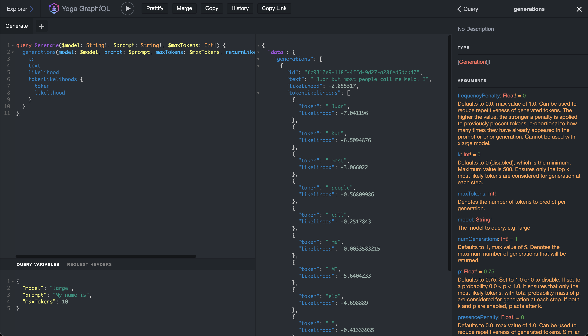

# cohere-graphql

Proof-of-concept of a GraphQL API for Cohere.

This GraphQL API is a simple wrapper around [Cohere's Generate API](https://docs.cohere.ai/generate-reference).

[](https://vercel.com/new/clone?repository-url=https%3A%2F%2Fgithub.com%2Felliottsj%2Fcohere-graphql)

## Usage

1. Visit `/api/graphql`.
2. Click **REQUEST HEADERS** and enter:

   ```json
   {
     "Authorization": "Bearer <your-api-key>"
   }
   ```

   Where `<your-api-key>` is your API key from https://os.cohere.ai/.

3. Make a GraphQL query, e.g.:

   ```graphql
   query Generate($model: String!, $prompt: String!, $maxTokens: Int!) {
     generations(
       model: $model
       prompt: $prompt
       maxTokens: $maxTokens
       returnLikelihoods: GENERATION
     ) {
       text
       likelihood
       tokenLikelihoods {
         token
         likelihood
       }
     }
   }
   ```

   With **QUERY VARIABLES**:

   ```json
   {
     "model": "large",
     "prompt": "My name is",
     "maxTokens": 10
   }
   ```



## Developing

```shell
pnpm install
```

Run in development mode:

```shell
pnpm dev
```

See [package.json](package.json) for other commands.
